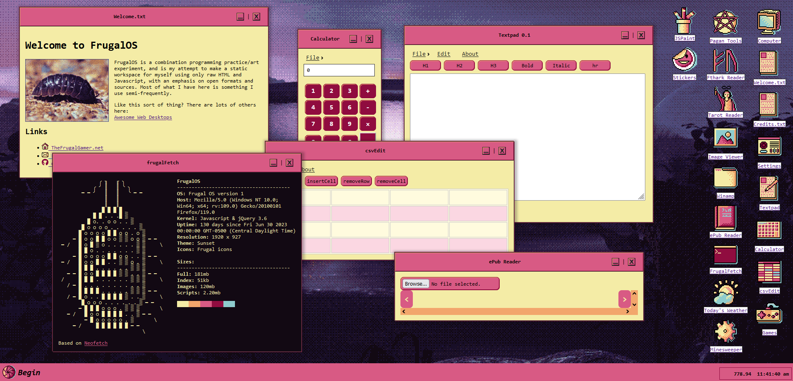

# FrugalOS
Combination art project and coding practice. This is my attempt to create an online workspace that is as static and open and possible, using plain HTML, CSS, and javascript. I have included Jquery, mostly because it automates several low-level things and can make things much faster, but other than that I'm trying to use as few plugins as possible.

<a href="https://www.thefrugalgamer.net/programming/FrugalOS/">Click here for the live version</a>

Currently it has the following functions:
* Text editing with import/export
* Calculator
* CSV Editing with import/export
* Minesweeper
* Weather "app" (it's just an iframe for now)
* ePub reader
* Image viewer
* Tarot reader
* Fthark rune reader
* Wheel of the year info + a few other rune readers
* Basic calendar functionality in taskbar
* To-do app
* Prompts app for inspiration
* Webamp with custom matching skim

I plan on adding more as time goes on, and will be working out various kinks and bugs. Feel free to leave feedback if you have any.
